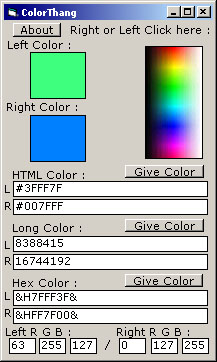



## ColorThang

### Description

Click in the picture box, gives the color, and gives you the HTML color, Hex Color, and RGB color values for that color.
 
### More Info
 

             |
---                |---
**Submitted On**   |2001-03-15 02:18:10
**By**             |[Fatty Cox](https://github.com/Planet-Source-Code/PSCIndex/blob/master/ByAuthor/fatty-cox.md)
**Level**          |Intermediate
**User Rating**    |4.7 (14 globes from 3 users)
**Compatibility**  |VB 5\.0, VB 6\.0
**Category**       |[Miscellaneous](https://github.com/Planet-Source-Code/PSCIndex/blob/master/ByCategory/miscellaneous__1-1.md)
**World**          |[Visual Basic](https://github.com/Planet-Source-Code/PSCIndex/blob/master/ByWorld/visual-basic.md)
**Archive File**   |[CODE\_UPLOAD170903152001\.zip](https://github.com/Planet-Source-Code/fatty-cox-colorthang__1-21654/archive/master.zip)

